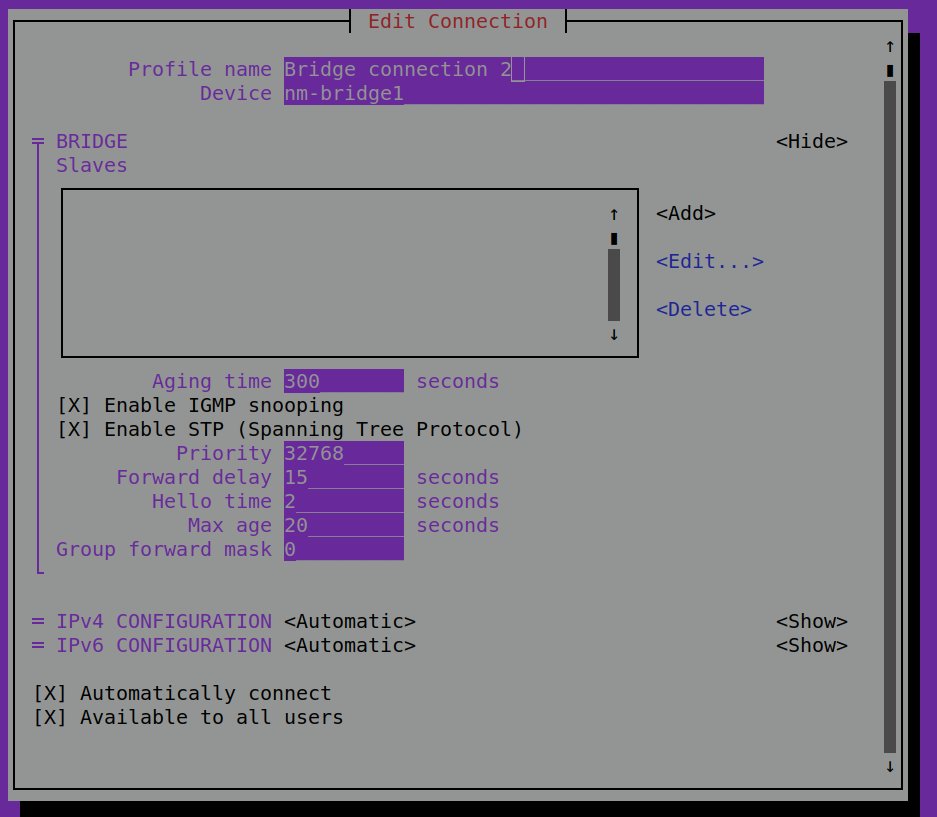

# Setup Qemu/KVM Ubuntu

## Installation

```bash
sudo apt install qemu qemu-kvm libvirt-clients libvirt-daemon-system bridge-utils virt-manager libguestfs-tools
```

## Migration and Tranfer VMs

### export qemu VM

  ```bash
    virsh dumpxml vm-name > /path/to/xm_file.xml
  ```

### import libvirt VM XML file as new VM

  ```bash
   virsh define /path/to/xmlfile.xml
  ```

### migrate from VirtualBox Image to Qemu/kvm

- convert to raw images

    ```bash
    VBoxManage clonehd --format RAW vbox.vdi target-raw.img
    ```

- convert to qemu images

    ```bash
    qemu-img convert -f raw target-raw.img -O qcow2 qemu.qcow2
    ```

## Networking

- List all networks

  ```bash
  sudo virsh net-list --all                       
  ```

- Start Network

  ```bash
  sudo virsh net-autostart <default>
  ```

- Set AutoStart for specific Network

  ```bash
  sudo virsh net-autostart default
  ```

### Bridge Network

1. use tool to configure and create bridge on host (for eathernet interface only):
  
   ```bash
   sudo nmtui
   ```
  
   - Deactivate current ehernet interface
   
   

   - add/create bridge with default settings
   
   

   - delete ethernet interface
    

   - add ethernet interface to bridge as slave
    
    

   - save and quit nmtui
    

1. Add new bridge NIC to VM

   


### Add networking printer

By default, A virtual NAT NIC is attached when a VM is created. Network printer on host network is not visible. The solution is to add another bridge(using host physical NIC) to the VM. Then the printer will be visible. This can be done directly in the Virt-Manager.

## Windows Guest

### make qemu work for any resolution on Windows guest

1. install [spice guest tools](https://www.spice-space.org/download/windows/spice-guest-tools/spice-guest-tools-latest.exe)
2. enable auto resize in `Virt-Manager`:  
   - `View` -> `Scale Display` -> `Auto resize VM with window`
3. modify video section in windows VM config file

   ```bash
   # for ubuntu 18.04, for later versions(20.04+) xml can be edited in virt manager GUI
   virsh edit <Windows-VM-Name>
   ```

   ```js
   <video>
      <model type='qxl' ram='131072' vram='131072' vgamem='32768' heads='1' primary='yes'/>
      <address type='pci' domain='0x0000' bus='0x00' slot='0x02' function='0x0'/>
    </video>
   ```

### Windows 11 installation

Windows 11 guest requires extra steps. And to make it work, `Ubuntu 20.04+` is recommended. The key point is to simulate TPM 2.0 on the host OS and configure it for the windows 11 guests.

- Install software TPM
  - Find appropriate swtpm version ppa and install dependencies. Here we use `Ubuntu 20.04 focal`.
  - 
    ```sh
    sudo add-apt-repository ppa:stefanberger/swtpm-focal
    sudo apt update
    sudo apt install -y swtpm swtpm-tools
    ```
  - When creating and configuring Windows 11 guest, in `virt-manager`
    - select Chipset as `Q35`, Firmware as `OVMF_CODE.secboot.fd`. If you cannot see the option, you may have not selected windows as OS type.
  
    

  - `Add Hardware`->`TPM`(version 2.0). If you are using Ubuntu `18.04 bionic`, the version option is not visible. You have to edit the raw XML.

    

## Linux Host and Windows Guest File Sharing(Shared Folder)

### Pre-Requirements

There are several ways for file sharing. One is Samba (better performance, but more trivial to config). Another is 
Spice Webdav Daemon. Here we focus on the spice solution.

On **host**, virt-manager does not come with shared folder option. We need `virt-viewer`, `spice-client` which are already 
installed in previous settings for qemu.

In Windows guest OS, we need to install [spice guest tools](https://www.spice-space.org/download/windows/spice-guest-tools/spice-guest-tools-latest.exe) 
and [spice webdev daemon](https://www.spice-space.org/download/windows/spice-webdavd/). 

### How to enable spice file sharing steps

- In virt-manager(host)
  - add Hardware -> add channel -> select device name `org.spice-space.webdav.0`
- In guest OS, enable spice webdavd 
  - run script `C:\Program Files\SPICE webdavd\map-drive.bat`
  - check if `spice-webdavd` service is running in services.msc
- (Important) Launch the VM 
  - launch VM through `Virt-Manager`
  - launch `virt-viewer`, it should be able to detect existing session, choose `connect`
  - in the menu of `virt-viewer`, from `File`->`Preferences`, check `Shared folder`, and **specify which folder on host** to share
  - The web drive should appear in Windows Guest **File Explorer**
