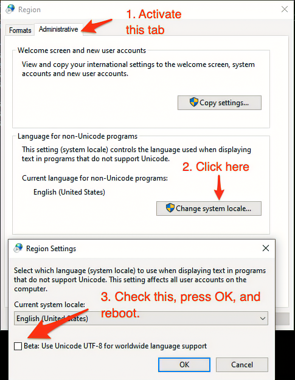

# Apps Installation List for Windows Dev Environment

- [Apps Installation List for Windows Dev Environment](#apps-installation-list-for-windows-dev-environment)
  - [Misc](#misc)
    - [App management Software](#app-management-software)
    - [Config X Server to display GUI from SSH session](#config-x-server-to-display-gui-from-ssh-session)
    - [Windows cannot Run Script in Powershell](#windows-cannot-run-script-in-powershell)
    - [Powershell display Grbled characters](#powershell-display-grbled-characters)
    - [Set startup application in Windows](#set-startup-application-in-windows)
    - [Install WSL](#install-wsl)
  - [Add autocompletion in Powershell](#add-autocompletion-in-powershell)
  - [Misc System and Productivity Apps](#misc-system-and-productivity-apps)
  - [Git install and config](#git-install-and-config)
    - [Make ssh agent run in background](#make-ssh-agent-run-in-background)

## Misc

### App management Software

Chocolatey tool

### Config X Server to display GUI from SSH session

- Install X Server App(Xming)

  ```ps1
  choco install xming
  ```

- Set Display Environment Variable
  
  ```ps1
  $env:DISPLAY = 'localhost:0.0'
  ```

- Connect with Authorized X11 Forwarding

  ```ps1
  ssh -v -Y <username>@<ipaddress> -p <port>
  ```

### Windows cannot Run Script in Powershell

```ps1
# check execution policy
 Get-ExecutionPolicy --List
# change policy for current user
 Set-ExecutionPolicy RemoteSigned -Scope CurrentUser
# change policy for local machine(most users and scripts)
 Set-ExecutionPolicy RemoteSigned -Scope LocalMachine
```

### Powershell display Grbled characters



### Set startup application in Windows

`Win+R`-> `shell:startup`-> right click then create a shortcut

### Install WSL

```ps1
wsl --install 
```

## Add autocompletion in Powershell

```ps1
# Create profile when not exist
if (!(Test-Path -Path $PROFILE.CurrentUserAllHosts)) {
  New-Item -ItemType File -Path $PROFILE.CurrentUserAllHosts -Force
}

# Open the profile with an editor (e.g. good old Notepad)
ii $PROFILE.CurrentUserAllHosts
```

```ps1
# Shows navigable menu of all options when hitting Tab
Set-PSReadlineKeyHandler -Key Tab -Function MenuComplete

# Autocompletion for arrow keys
Set-PSReadlineKeyHandler -Key UpArrow -Function HistorySearchBackward
Set-PSReadlineKeyHandler -Key DownArrow -Function HistorySearchForward
```


## Misc System and Productivity Apps

- AutoHotKey
  
  ```ps1
  choco install autohotkey
  ```

- Github Desktop
  
  ```ps1
  choco install github-desktop
  ```
  
- copyq
  
  ```ps1
  choco install copyq
  ```

- oh-my-posh (2.0)
  
  ```ps1
  choco install oh-my-posh
  # after installation, we need to modify the profile file
  code $PROFILE
  # append 
  # Invoke-Expression (oh-my-posh --init --shell pwsh --config $env:LocalAppData/Programs/oh-my-posh/themes/pure.omp.json) 
  # to the end of the file
  ```

- poshgit
  
  ```ps1
  choco install poshgit
  ```

- vscode

  ```ps1
  choco install vscode
  ```

- Teams
  
  ```ps1
  choco install microsoft-teams
  ```

## Git install and config

After install `git-desktop`, configure git account.

### Make ssh agent run in background

```ps1
# Make sure you're running as an Administrator
Set-Service ssh-agent -StartupType Automatic
Start-Service ssh-agent
Get-Service ssh-agent
# Generate ssh key
ssh-keygen -t ed25519 -C "your_email@example.com"
ssh-add ~/.ssh/id_ed25519
```

copy the content from  `~/.ssh/id_ed25519.pub` to github account.
